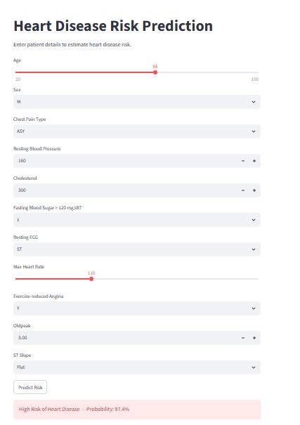
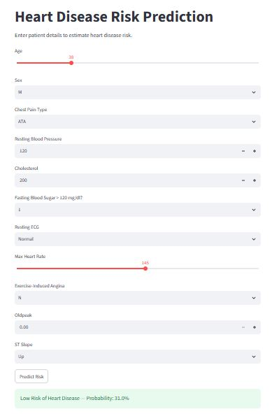

# Heart Disease Risk Prediction

An end-to-end machine learning project that predicts a patient's risk of heart disease based on clinical parameters, deployed as both a REST API and an interactive web app.

## Problem Statement

Cardiovascular disease is one of the leading causes of death worldwide. Early risk detection using clinical data can help doctors prioritize further testing and intervention. This project builds a machine learning model that estimates a patient's heart disease risk from basic clinical measurements, and wraps it in a usable application.

## Dataset

- **Source:** [Heart Failure Prediction Dataset (Kaggle)](https://www.kaggle.com/datasets/fedesoriano/heart-failure-prediction)
- 918 patient records with 11 clinical features (age, sex, chest pain type, resting blood pressure, cholesterol, fasting blood sugar, resting ECG, max heart rate, exercise-induced angina, oldpeak, ST slope) and a binary target (presence of heart disease).

## Approach

1. **Exploratory Data Analysis** — checked for missing values, class balance, and feature correlation with the target.
2. **Preprocessing** — encoded categorical features, split data into train/test sets (80/20, stratified).
3. **Model Training & Comparison** — trained and evaluated three models: Logistic Regression, Random Forest, and XGBoost.
4. **Model Selection** — selected the best model based on **recall**, since in a medical screening context, missing a positive case (false negative) is more costly than a false alarm.
5. **API** — built a REST API with FastAPI that serves predictions from the trained model.
6. **Web App** — built an interactive Streamlit interface so a user can enter patient details and get an instant risk assessment.

## Results

| Model | Accuracy | Recall | ROC-AUC |
|---|---|---|---|
| Logistic Regression | 0.875 | **0.931** | 0.868 |
| Random Forest | 0.875 | 0.902 | 0.872 |
| XGBoost | 0.870 | 0.863 | 0.870 |

**Selected model: Logistic Regression** — highest recall (93.1%), meaning it catches the highest proportion of actual heart disease cases, which is the priority metric for this use case.

## Screenshots

**High Risk Prediction**

**Low Risk Prediction**

## Tech Stack

- **Language:** Python
- **ML/Data:** pandas, scikit-learn, XGBoost, joblib
- **API:** FastAPI, Uvicorn
- **Web App:** Streamlit

## Project Structure